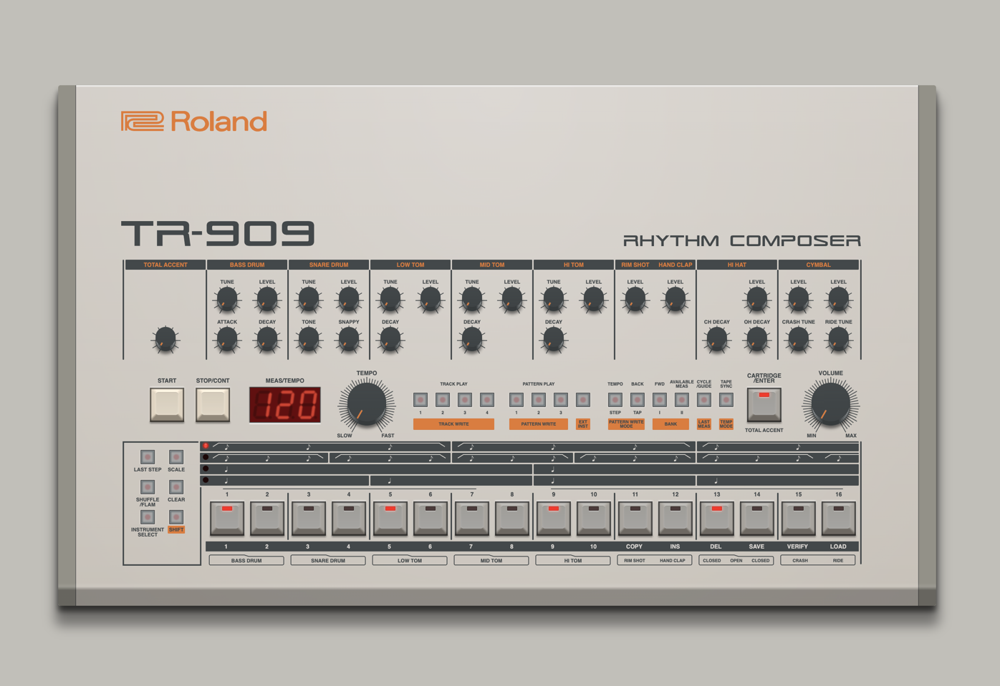

# Css-909

Building the Roland TR-909 drum-machine with only html, svg & css.

[Open](https://andremichelle.github.io/css909/) | [Wiki](https://en.wikipedia.org/wiki/Roland_TR-909)

Make sure to have sass installed and run in the console:

    sass sass/main.sass:bin/main.css --watch

Make sure to have typescript installed and run in the console:

    tsc -p ./typescript/tsconfig.json --watch