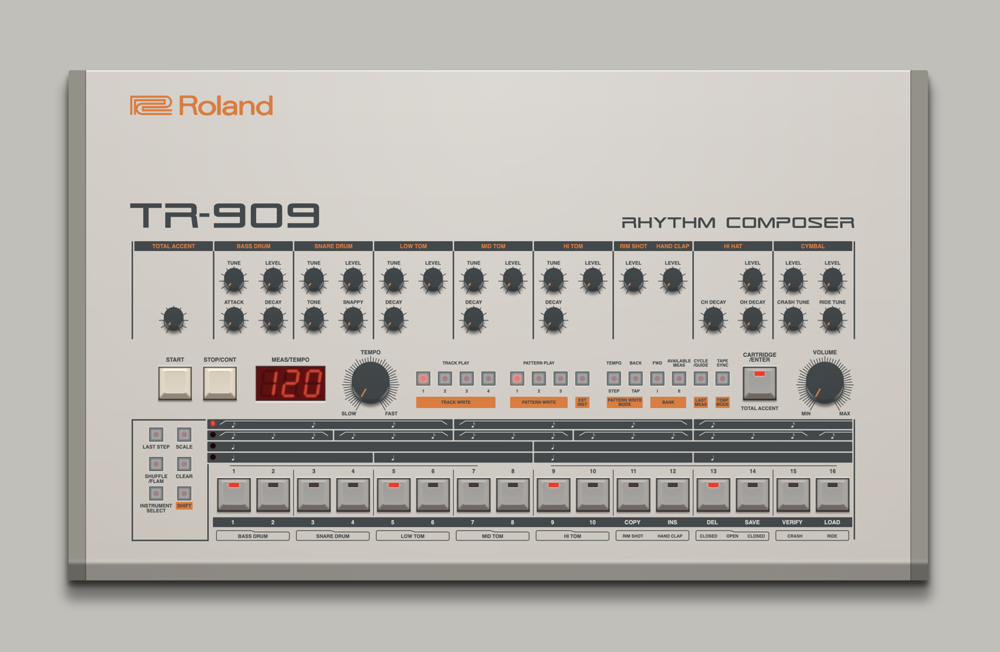

### Css-909

Roland TR-909 drum-machine with only html, svg & css. No sound engine.

_**The use of any trade name or trademark is for identification and educational purposes only and does not imply any association with the trademark holder of their product brand.**_

[Open](https://andremichelle.github.io/css-909/) | [Wiki](https://en.wikipedia.org/wiki/Roland_TR-909)

### Build
Make sure to have sass installed and run in the console:

    sass sass/main.sass:bin/main.css --watch

Make sure to have typescript installed and run in the console:

    tsc -p ./typescript/tsconfig.json --watch